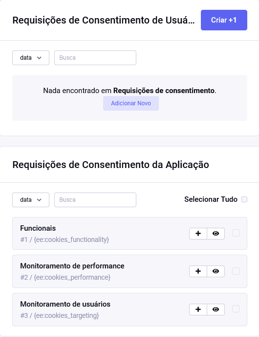

# Requisições de consentimento

No momento, apenas as **Requisições funcionais** estão em uso. Porém, há ainda duas seções de consentimento próprias do sistema, além de novas opções que podem ser criadas.



O modelo para a página com o texto explicativo está em `default_site/privacidade_group/cookies.html`.

Scripts personalizados que precisam rodar após o _aceite de consentimento_ podem seguir o seguinte exemplo:

```html
<script>
  window.dataLayer = window.dataLayer || [];
  function gtag() {
    dataLayer.push(arguments);
  }
</script>

<script data-js="ee:cookies_functionality" data-src="https://www.googletagmanager.com/gtag/js?id=GOOGLE-TAG-ID"
onload="gtag('js', new Date()); gtag('config', 'GOGLE-TAG-ID');"></script>
```

Após o aceite, o atributo `datas-src` mudará para `src` o script será carregado e rodará o código no script `onload`. Os elementos são reconhecidos pelo atributo e valor `data-js="ee:cookies_functionality"`.
