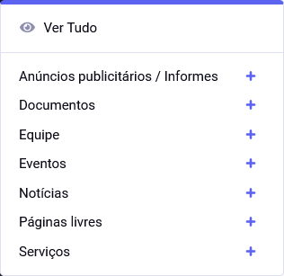
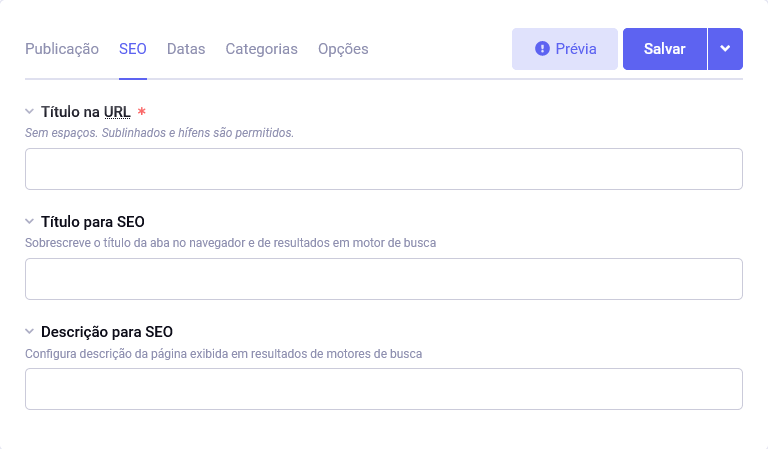
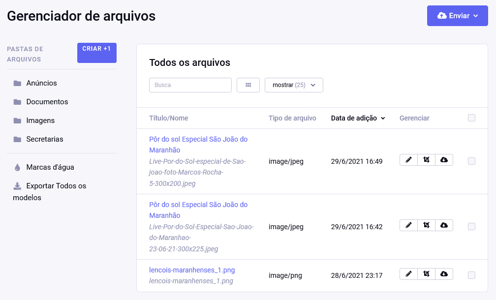
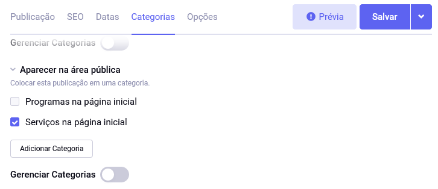
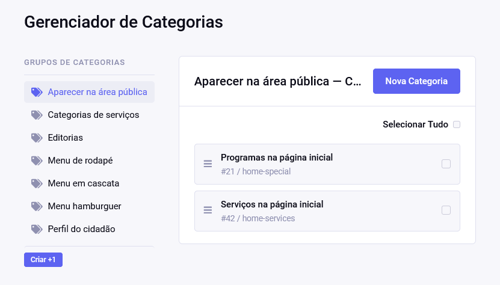
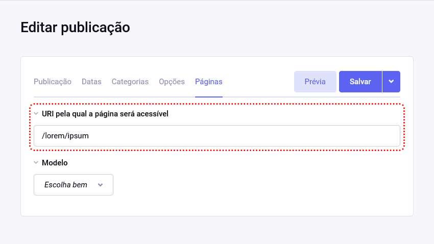
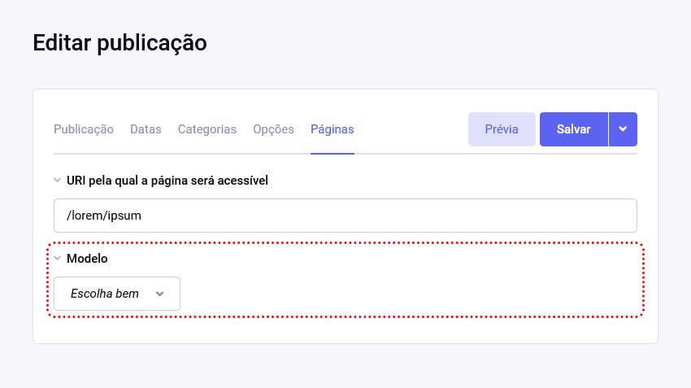
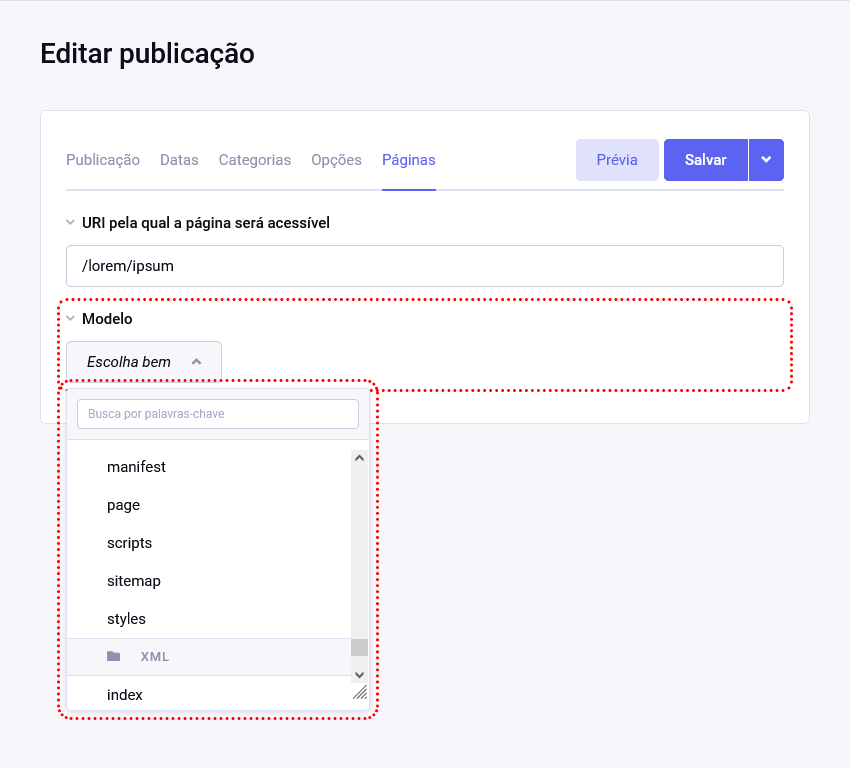
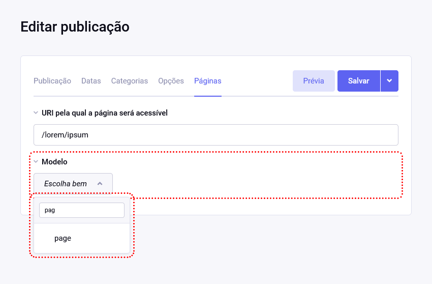
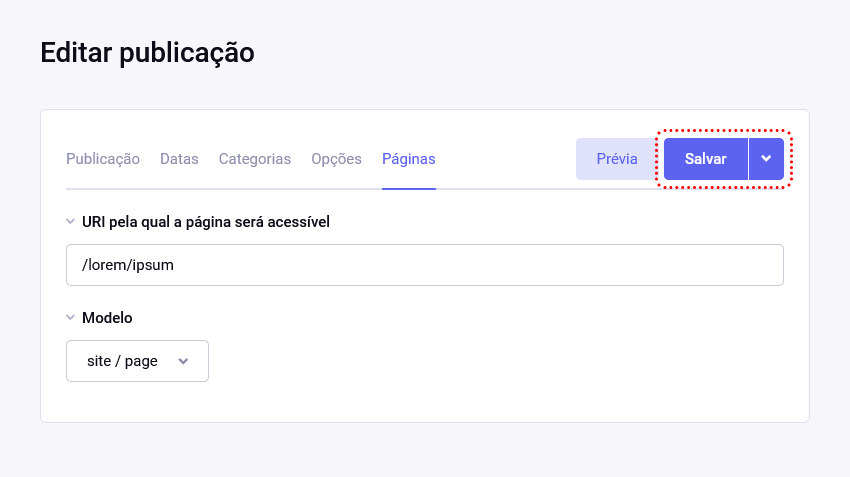

# Gerenciamento de conteúdo

Panorama do **Sistema de Gerenciamento de Conteúdo**.

Do lado esquerdo, há um menu que, a depender das suas permissões como integrante, exibe as funções disponíveis.

## Publicação de conteúdo

As listagens dos diferentes tipos de publicação podem ser acessados todos pelo mesmo menu.

Cliques nos sinais de **+** abrem diretamente o formulário para criação de uma nova publicação.

## SEO

Campos que influenciem diretamente na maneira como o Google classifica o conteúdo da página têm uma aba dedicada nos formulários de publicação quando pertinente.

*[SEO]: Search Engine Optimization

## Gerenciamento de arquivos

## Gerenciamento de status de publicação

Para controlar a exibição e ordem das publicações salvas, independentemente de seu tipo, segue um conjunto básico de _statuses_. Podemos modificá-lo ou criar outros grupos.

- abertas
- fechadas
- destacadas

## Taxonomias

**Taxonomias** são critérios de classificação e que podem ser usado para agrupar publicações. Por exemplo, _tags_, categorias, escola artística, tipo, nacionalidade...

### Tipos de notícias

No caso de _press releases_ terem a exata configuração de notícias, faz-se necessário separá-los uns dos outros com uma taxonomia.

### Tópicos

Classificação das notícias por assunto. Segue lista de forma alguma esgotada de exemplos:

- calendário oficial;
- campanha de vacinação;
- COVID-19;
- desmatamento;
- educação;
- impostos;
- habitação;

### Posicionamento na área pública

Há um grupo de categorias chamado **Aparecer na área pública** com posições configuradas. Elas podem ser escolhidas na aba _Categorias_ do formulário de publicações.

Os títulos usadas na área pública seguem [os títulos das categorias em si](/admin.php?/cp/categories/group), para manter as configurações simples. Porém, para continuarem funcionando, seus **títulos em URL** devem se manter `home-special` e `home-services`.

## Tipos de publicações

### Anúncios publicitários / Informes

Serão apresentados no site como banners, painéis fixos ou painéis flutuantes/_dialogs_/_modais_/_in page popups_.

Campos:

- título
- data inicial
- data final
- resumo
- imagem em diferentes formatos:
  - estreita, para dispositivos móveis
  - larga, para dispositivos de mesa
- link
- posição na página
  - cabeçalho
  - coluna lateral
  - rodapé
  - painel flutuante em um endereço específico

Taxonomias:

- secretarias

### Documentos

Documentos abertos aos cidadãos para manter um governo transparente.

Campos:

- título
- descrição
- arquivo
- conteúdo relacionado - publicações escolhidas manualmente entre **Notícias**, **Eventos** e **Serviços**

Taxonomias:

- secretarias
- tópicos

### Equipe

Publicações definem o organograma hierárquico da secretaria e podem ou não estar atreladas aos perfis de usuários do sistema.

Sugerimos que sejam separadas, para que apenas reais usuários do sistema tenham senhas.

Campos:

- nome;
- biografia;
- email público - que pode ser limitado ao domínio do site do governo, no caso, `ma.gov.br`;
- número público de telefone;
- n × campos extras
  - título
  - texto
- posição - a escolher a partir de lista predefinida para evitar erros de nomenclatura ou ortografia. Todas as opções devem ser femininas ou neutras em gênero.
  - opções:
    - direção;
    - presidência;
    - assessoria jurídica;
    - ...

### Eventos

Ocorrências em espaço físico ou virtual com convidados oficiais, públicos ou ações coletivas.

Campos:

- título;
- conteúdo
- ocorrências
  - data inicial;
  - data final;
- inúmeros child events - para o caso de um evento ser composto de vários outros. Por exemplo, uma _Semana de Cultura_, _Mês de vacinação_, etc...
- inúmeros dados diversos, para pequenos conjuntos extras de informação:
  - título
  - conteúdo
- inúmeras erratas / atualizações
  - data
  - conteúdo
- n × campos extras
  - título
  - texto

Taxonomias:

- secretarias
- tópicos

Taxonomias:

- secretarias

### Notícias

As notícias podem ser a respeito do Estado em si, de uma secretaria ou comuns a mais de uma delas; por exemplo, PROCON e Secretaria do Meio Ambiente, ao mesmo tempo. Portanto, devem ser independentes das secretarias.

Campos:

- título;
- título exclusivo para página única - opcional para o caso dele ser diferente do que aparece em listagens;
- resumo - opcional para ser exibido em listagens, ao invés de um recorte automático do conteúdo
- conteúdo;
- data;
- galeria:
  - inúmeros conjuntos de:
    - imagem estreita, para dispositivos móveis
    - imagem larga, para dispositivos de mesa
    - descrição;
    - legenda;
- link opcional da fonte
- inúmeros dados diversos, para pequenos conjuntos extras de informação:
  - título
  - conteúdo
- inúmeras erratas / atualizações
  - data
  - conteúdo
- conteúdo relacionado - inúmeras publicações escolhidas manualmente entre **Notícias**, **Eventos**, **Documentos**, **Serviços**;
- n × campos extras
  - título
  - texto

Taxonomias:

- secretarias
- tipos de notícias
- tópicos

### Páginas livres

Páginas livres para conteúdos que não se classificam nas outras situações sugeridas.

Campos:

- título
- título exclusivo para página única - opcional para o caso dele ser diferente do que aparece em listagens;
- conteúdo
- n × campos extras
  - título
  - texto

Taxonomias:

- secretarias

### Serviços

Descrição de serviços prestados pelas secretárias para alimentar a busca.

Campos:

- título
- título exclusivo para página única - opcional para o caso dele ser diferente do que aparece em listagens;
- resumo - opcional para ser exibido em listagens, ao invés de um recorte automático do conteúdo
- conteúdo;
- custo:
  - valor - com "gratuito" como opção;
  - unidade;
- link para sistema específico
- definition list × n
- press kits

Taxonomias:

- secretarias

### Links sugeridos

Especialmente para **parceiros e serviços**. Porém, precisamos rever a necessidade no caso de todos as secretarias e seus serviços se juntarem, o que é improvável. Alguns serviços, como _agendamento de emplacamento de veículo_ devem ficar de fora.

- URL
- nome
- secretaria - selecinada a partir de uma lista fechada?
- texto adjacente opcional

### Sobrescrição de URLs

Às vezes, precisamos sobrescrever a URI pela qual uma página é acessada. Por exemplo, todos os documentos são encontrados em `/documentos/NOME-DO-DOCUMENTO`. Porém, um em especial não se enquadra entre os outros e precisaria de uma URI `/NOME-DO-DOCUMENTO`. A aba **Páginas** da tela de publicação atende a esses casos.

Em seu primeiro campo, preencha a URI desejada começando por `/`.

Em seguida, declare qual arquivo de modelo deve ser usado para exibí-la.

Todos os modelos em uso no website serão listados.

O modelo mais provável de ser usado é o chamado `pages`. Comece a digitar seu nome no campo de busca para encontrá-lo mais facilmente.

Agora, lembre-se de salvar suas modificações.

