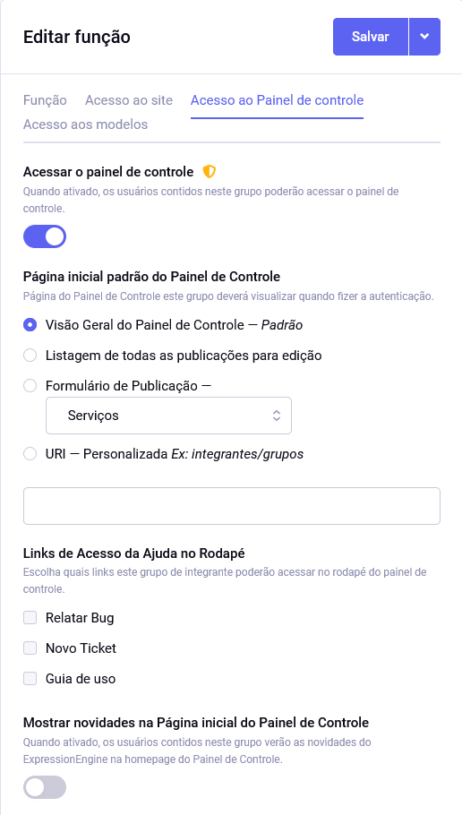
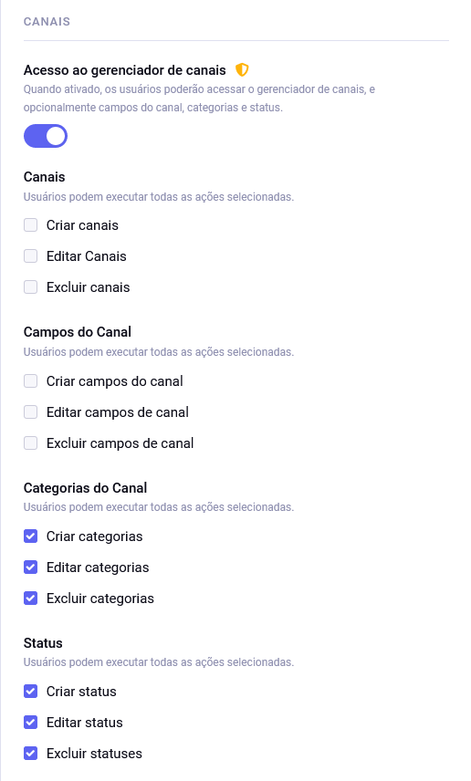
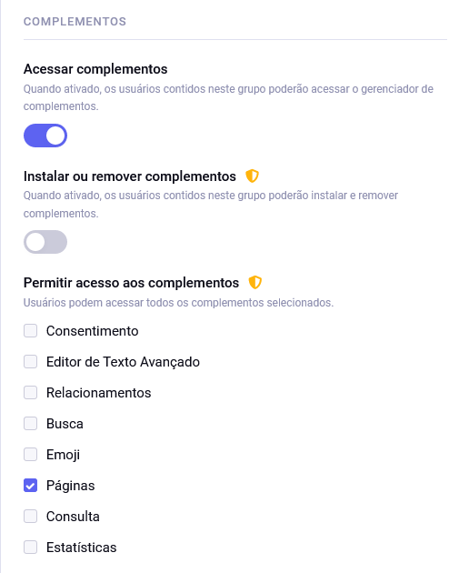
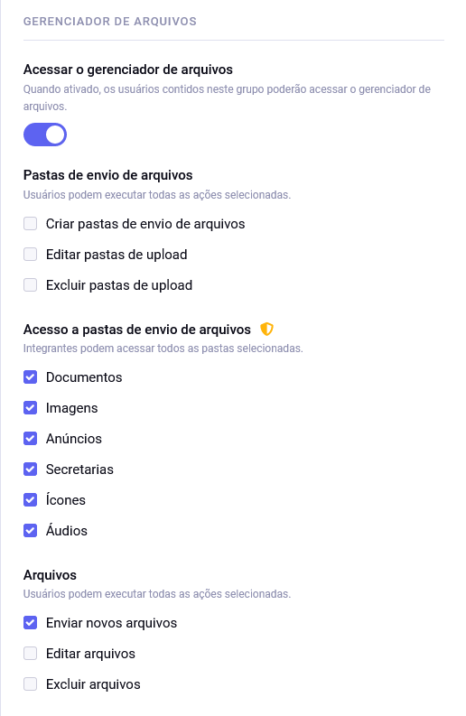
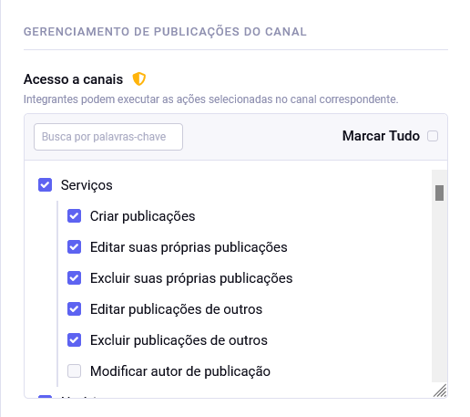

# Configurações de integrantes

Ao editar as **Funções** atribuídas a um integrante, atente para o acesso ao painel de controle do site desejado.

O gerenciador de canais deve ser acessado por administradores apenas, com **exceção** dos menus relativos a categorias.

Para quem apenas cuida do conteúdo, o único complemento necessário é o **Páginas**.

Geralmente, integrantes não deveriam ter permissão para apagar publicações uns dos outros.

