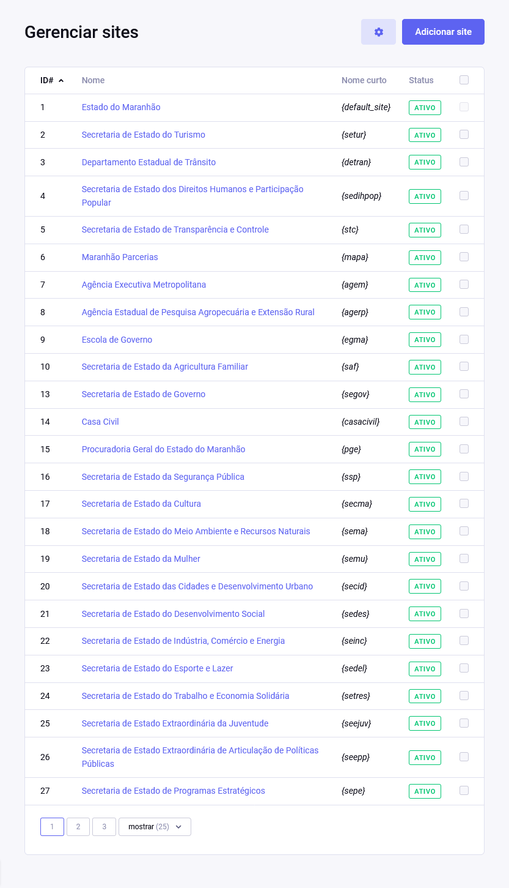
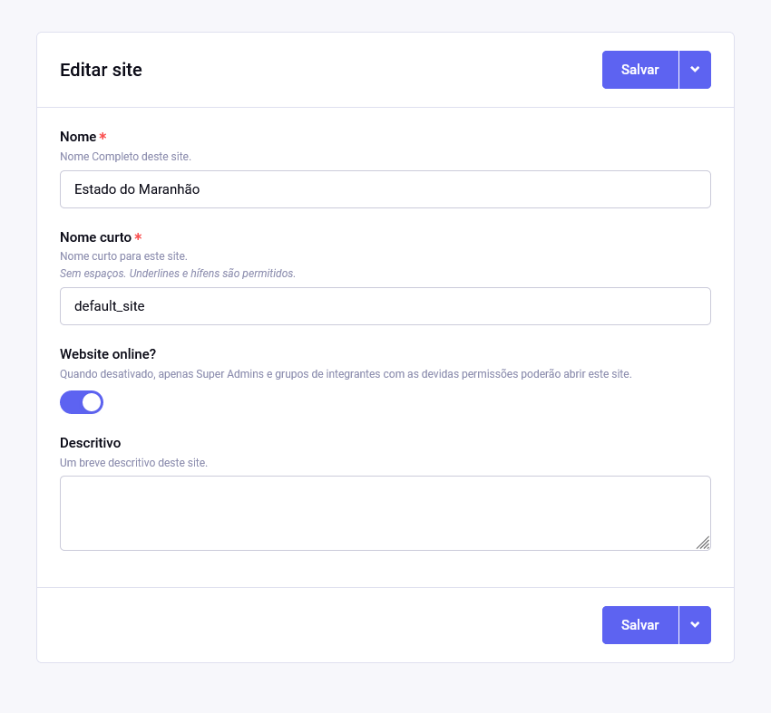

# Configurações por site

Há uma opção na seão **Desenvolvedor** do menu para **Gerenciar sites** e que exibe uma lista de todos os sites configurados no sistema.

As únicas opções disponíveis que exclusivas por site são:

- **Nome**;
- **Nome curto** - que não deve ser editado a não ser que se tenha consciência dos efeitos colaterais;
- **Website online?** - para colocar apenas o site escolhido froa ou no ar;
- **Descritivo**

## Configurações personalizadas

Para os sites desse projeto, um conjunto especial de configurações foi criado:

- **Cabeçalho** (`{settings__header}`) - imagens e cores do cabeçalho
- **Cabeçalho das notícias** (`{news__header}`) - imagens e cores usados unicamente no cabeçalho das notícias do portal
- **Logotipo** (`{settings__logotype}`) - logotipo do site/secretaria/departamento
- **Exemplo de busca** (`{settings__search_placeholder}`) - texto auxiliar exibido dentro do campo de busca do cabeçalho
- **Sugestões de busca** (`{settings__search_suggestions}`) - lista de sugestões exibidas logo após o campo de busca do cabeçalho
- **Exibir como secretaria?** (`{is_not_commission}`) - usado para separar as secretarias dos departamentos
- **Layout** (`{template_file}`) - layouts alternativos para as secretarias
- **E-mail público** (`{settings__email}`)
- **Endereço público** (`{settings__address}`)
- **Horário de atendimento** (`{opening_hours}`)
- **Redes sociais** (`{social_profiles}`)
