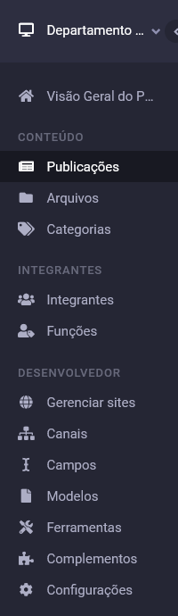
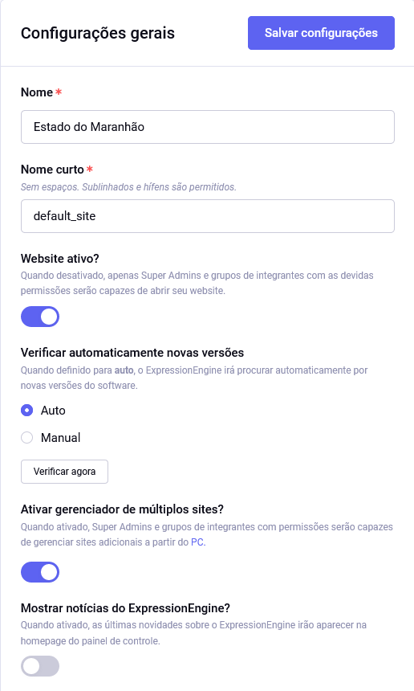

# Configurações do EECMS

As configurações são acessadas no último item da seção **Desenvolvedor** do menu completo.

## Configurações gerais

Nessa seção de configurações, **Website ativo?** corresponde a **todos** os sites do sistema. Desabilitá-la colocará todos os sites do sistema do ar.

## Configurações "forçadas"
Algumas configurações estão definidas no arquivo `./data/system/user/config/config.php` para segurança e fácil versionamento. Pode-se ler a respeito delas na [documentação oficial](https://docs.expressionengine.com/latest/general/system-configuration-overrides.html).
