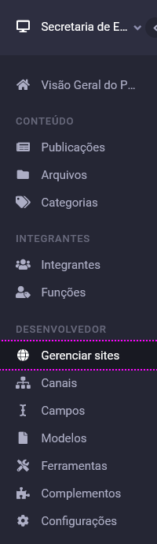
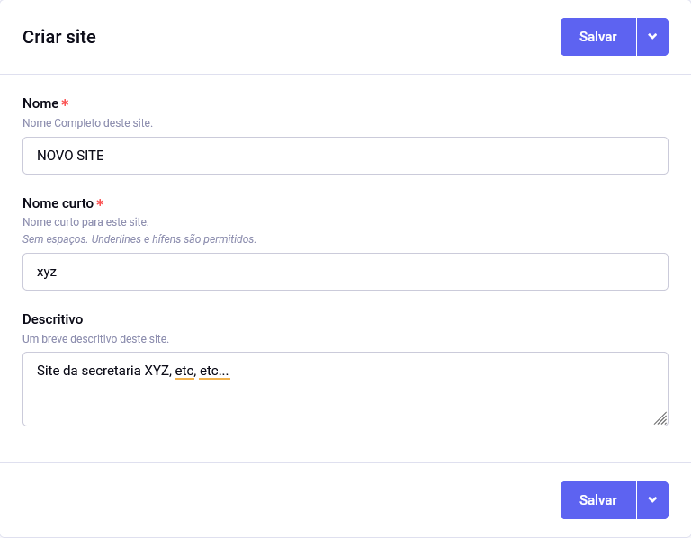
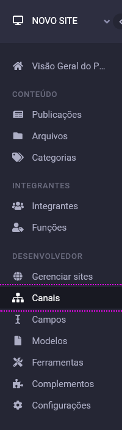
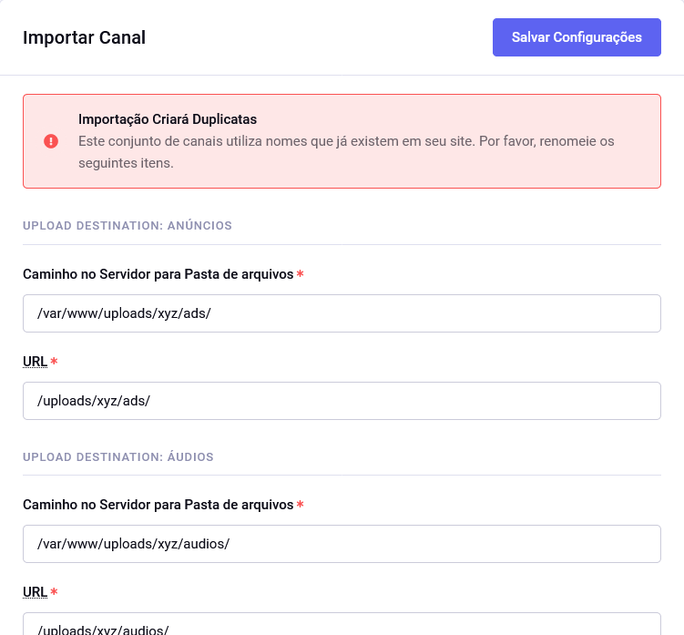

# Passo-a-passo para implementação de um novo site

Nota: Usando `xyz` como exemplo.

## Preparar arquivos

No repositório de controle de versão, adicione o site em `data/system/user/config/domains.php`. Subdomínios `www` ou `www0` não são necessários.

```php
    [
        'hosts' => [
            'xyz.ma.gov.br', // domínio real
            'xyz.ma.gov.local', // domínio para desenvolvimento local
        ],
        'site_name' => 'xyz' // nome curto do site
    ],
```

 Caso o site seja "parcial", um daqueles que manterá sua estutura própria separada, adicione `xyz` à variável de configurações `global:not_sites` no arquivo `/data/system/user/config/config.php`:

```php
$assign_to_config['global_vars']['global:not_sites'] = 'caema|cbm|detran|diariooficial|fapema|imesc|iprev|jucema|pm|policiacivil|procon|saude|seati|sefaz|segep|ssp|xyz';
```

Replique os templates _proxy_ de outro site que não o raiz (`default_site`) por exemplo, `aged`:

```shell
cd data/system/user/templates/
cp -R aged xyz
```

Replique os diretórios de envios de arquivos:

```shell
cd data/html/uploads/
cp -R ma xyz
```

Esses diretórios para envio de arquivos contém apenas arquivos `.gitignore` para manter sua estrutura.

Salve essas modificações no seu gerenciador de versões:

```shell
git add ./data/html/uploads/xyz/*
git add ./data/system/user/templates/xyz/*
git add ./data/system/user/config/domains.php
git add ./data/system/user/config/config.php

git commit -m "Add xyz site"
```

Coloque as modificações no ar.

## Configurar

No menu principal, acesse **Desenvolvedor** -> **Gerenciar sites**.



Ao preencher os dados do site, atente para manter seu **Nome curto** como previamente definido.



No topo do menu principal, troque o site em controle.

Para criar os canais, no menu principal, acesse **Desenvolvedor** -> **Canais**.



Importe o modelo de canais para todos os sites disponível no repositório de versionamento, na pasta `/_work-files/channel_sets/channel_sets.zip`.


No formulário seguinte, informe os caminhos dos diretórios criados para esse site específico.



Agora que todos os canais estão criados, prepare as configurações personalizados. Acessando no menu principal **Conteúdo** -> **Publicações** -> **Configurações**.


[Configurar as permissões](/docs/members.html) é a última etapa.
